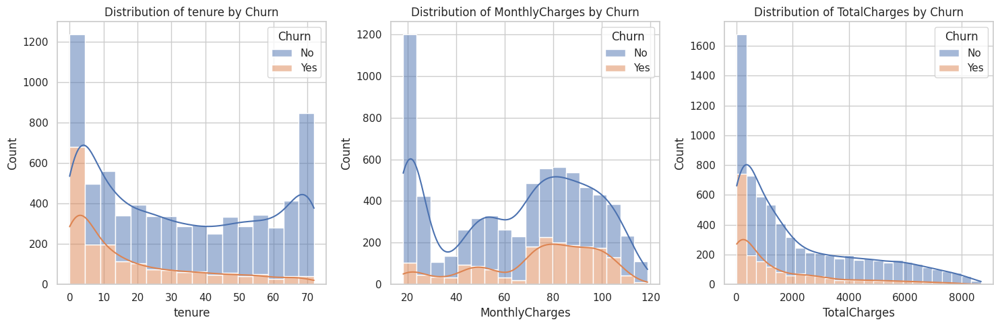

# Data Analytics with ChatGPT

Welcome to the `DataAnalyticsWithChatGPT` repository, where we explore the powerful synergy between advanced AI models like ChatGPT 4 and the dynamic world of Machine Learning and Data Analytics.

## About This Repository

This repository is a hub for tech enthusiasts, professionals, and students who are interested in understanding how AI can revolutionize data analysis. We focus on practical, real-world applications, demonstrated through comprehensive PDF guides and Jupyter notebooks.

### What You'll Find Here

- **PDF Guides**: Covering various aspects of Machine Learning and Data Analytics, these guides are designed to offer you in-depth knowledge in an easily digestible format.
- **Jupyter Notebooks**: Dive into our interactive notebooks, like `TelcoCustomerChurnEDA` and `updated_churn_with_descriptions`, showcasing real data analytics scenarios. These notebooks include:
  - Exploratory Data Analysis (EDA) on telecom customer churn
  - Insightful visualizations and interpretations
  - Step-by-step commentary explaining each analysis stage

### Harnessing ChatGPT 4 for Data Analytics

ChatGPT 4, with its advanced capabilities in understanding and generating human-like text, is a game changer in data analytics. In this repository, you will see how ChatGPT 4 can:
- Aid in interpreting complex datasets
- Automate reporting and analysis
- Provide explanations and summaries of data trends and patterns

## Getting Started

1. **Clone the Repository**: Get a local copy of our repository for easy access to our materials.
2. **Explore the Notebooks**: Open the Jupyter notebooks to see data analytics in action. Feel free to modify and experiment!
3. **Read the Guides**: Our PDFs are a great starting point to deepen your understanding of the concepts discussed in the notebooks.

## Sample Visualizations

Here are some visualizations from our notebooks:

*Note: These visualizations are interactive in the Jupyter notebooks.*

## How to Contribute

We encourage contributions! Whether it's improving the guides, adding new analysis in the notebooks, or suggesting new data sets to explore, your input is valuable.

## Contact

Have questions or suggestions? Feel free to [open an issue](link-toissues-github-) or contact us directly at itaybd at gmail dot com .
